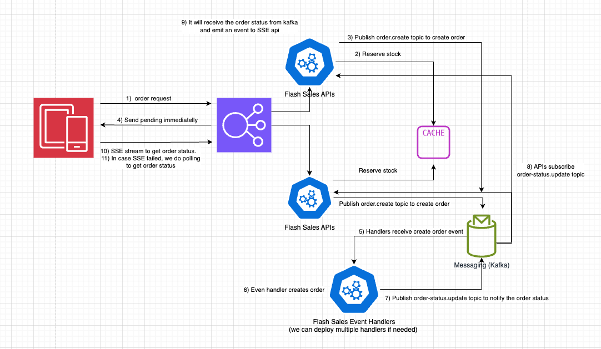
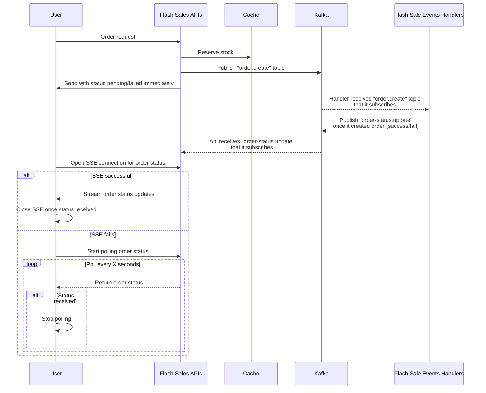
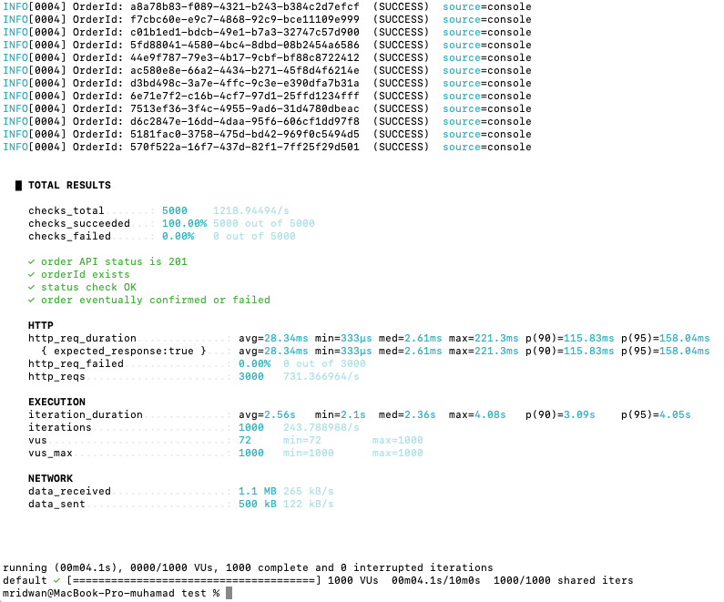

# Flash Sales

## Design

Here is the proposed design:




```
Notes:

- Ideally, we would store the created order in the database, but here, to keep things simple, I’m just storing the order in Redis.

- The consumer of the "order.create" topic will be part of a consumer group to ensure that each message is handled by only one consumer in the group.

- For "order-status.update," if we deploy multiple API instances, we need to assign a unique consumer ID to each instance to ensure that every API instance receives the order status updates and can forward them to the client via SSE.
```

## Setup via Docker Compose

A Docker Compose script is provided in the `/infra` directory. Running this script will start two Docker containers: one for kafka and one for Redis.

- Prerequisites: Docker and Docker Compose must be installed locally.
- Go to `/infra` directory
- Run: `docker compose -p test-assessment -f docker-compose.yml up -d`

Once the containers are running, create a `.env` file in the `/server` directory and set the following variables:

```
REDIS_HOST=localhost
REDIS_PORT=6388
REDIS_PASSWORD=redispassword
REDIS_TLS_ENABLED=false

KAFKA_CLIENT_ID=assessment-test
KAFKA_BROKERS=localhost:9092
```

## Run the server

- Go to the `/server` directory
- Run: `npm run start:api`

This will start the API in port: `7000`.

This app starts/runs both the API and the flash sales (in 1 hour)

## Run the flash sale events handlers

- Go to the `/server` directory
- Run: `npm run start:flash-sale-events-handlers`

This will start the flash sale events handlers.

## Test product order

- Open your browser
- Go to the `/localhost:7000`
- Input username and qty
- Click "Buy Now"

## Run stress test

- Install K6: `brew install k6`
- Go to `/test` directory
- Run : `k6 run stress-test.js`

Sample result:

